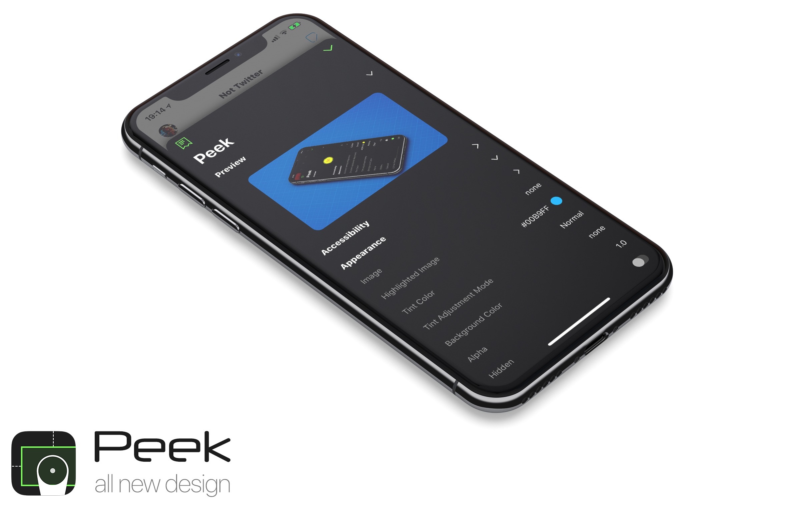

<a href="https://vimeo.com/162896152"></a>

# Peek

[](http://cocoapods.org/pods/Peek)
[](http://cocoapods.org/pods/Peek)
[](http://cocoadocs.org/docsets/Peek)
[](http://cocoapods.org/pods/Peek)

Peek is an open source library that lets you easily check your application against your user interface's specification guide(s). Peek can be used by engineers, designers & testers, allowing developers to spend more time on code and less time checking that fonts, colors and layout are pixel perfect.

# Swift Support

**Swift 4.0**

This is the current release.

**Swift 3.x**

Swift 3.x unfortunately broke some of the compatilibity issues I required to work with the runtime.
Please use the Swift 4 version instead.

**Swift 2.3**

If you need Swift 2.3 support, update your Podfile as such:

`pod 'Peek', '2.3'`

**Swift 2.2**

If you need Swift 2.2 support, update your Podfile as such:

`pod 'Peek', '2.0'`

---

# Changelog

4.0
-

Just a Swift compatibility update.
Minor changes as per Swift APIs but no functional changes to Peek.

3.0
-

Swift 3.x unfortunately broke some of the compatilibity issues I required to work with the runtime.
Please use the Swift 4 version instead.

2.2.0
-

* Slack integration
* Email reports
* Screenshot upload block (for Slack)
* NSAttributedString support, including paragraph styles

2.1.0
-

* Enable with options
* Force shake gesture on device
* Allow container selection

2.0
-

* Absolute layout overlay
* Multiple inspectors
* Swift Support
* iOS 8.3 Support

# How does it work?

Tap your volume key(s) to activate/deactivate Peek.

Then tap, or drag your finger across the screen to select a component and see its layout information.

Double-tap anywhere on the screen to bring up the Peek Inspectors. Here peek will show you contextual information about the view you're inspecting. For example, a label will show information such as `font` and `textColor`, whereas an image might show information about its `size` or `scaling mode`.

You can also tap and hold on any property to copy it to your pasteboard. More features coming soon regarding this -- which will allow you to report issues back to your dev(s).

Peek currently supports a single overlay mode, but more are coming soon -- including an overlay that allows you to see measures *between* components!

# Demo

The quickest way to see how awesome and useful Peek is, is by downloading this repo and running the sample project included.

Its a small app that perfectly demonstrates the power of Peek!

# How do I get started?

Peek was designed to be extremely easy to use.

If you're a designer, send a link to this page to your dev(s) :)

For developers, simply use CocoaPods (alternativel you can simply drag the files into your project)

```ruby
pod 'Peek'
```

Then add a single line to your app. For iOS 8/9 you can add this to your AppDelegate.swift file.
If you're using iOS 10.0+ you will need to add this to your window's rootViewController.

```swift
window?.peek.enabled = true
```

Optionally, I'd suggest adding the `DEBUG` Swift compiler flag and changing the code to:

```swift
#if DEBUG
  window?.peek.enabled = true
#endif
```

You can also provide options when enabling Peek:

```swift
window?.peek.enableWithOptions { options in

  // Peek will require a shake on the device and simulator
  options.activationMode = .Shake 
  
  // Container views (UIView) will not be ignored -- Note: this does not include system containers
  options.shouldIgnoreContainers = false
}
```


Now whenever you run your app, you can now activate/deactivate Peek by pressing one of the volume keys on your device ;)

# Configuring Peek

Peek allows many options to be configured, allowing you more control over how Peek is configured as well as reporting options:

```swift
window?.peek.enableWithOptions { options in
  options.activationMode = .Auto
  options.shouldIgnoreContainers = true
  
  /*
   In order to use Slack, you need to define a username, recipient (either a channel or user, e.g. #peek or @peek)
   You also need to provide your Slack Incoming WebHook URL
   
   https://slack.com/apps/A0F7XDUAZ-incoming-webhooks
   */
  options.slackUserName = "Peek"
  options.slackRecipient = "#peek"
  // options.slackWebHookURL = NSURL(string: "https://hooks.slack.com/services/$TOKEN")!
  
  /*
   Email support works by default, but you can also configure options like recipient(s) & subject
   */
  options.emailRecipients = [ "" ]
  options.emailSubject = "Peek Issue: "
  
  /*
   Both email and Slack reporting can use an optional metaData dictionary of key/values -- this is useful for providing additional context, like the environment your application is currently pointing to
   */
  options.reportMetaData = [ "Environment": "UAT" ]
  
  /**
   Both email and Slack support including screenshots. For email, you don't need to do a thing, it JUST WORKS out of the box.
   However, Slack doesn't support direct image uploads via WebHooks, so instead you can provide an image upload block that will automatically execute when you try to post to Slack.
   
   Note: The upload block is already dispatched to a background queue, so you can run your code synchronously.
   
   Just use the provided session and image, upload it to your service and return the resulting URL
   */
  options.includeScreenshot = true
  options.screenshotScale = 1
  
  /*
   This block is required if you want to upload image URLs to Slack.
   The image is generated automatically and appended to your messages for you.
  */
  options.slackImageUploader = { (session, image) in
    return NSURL(string: "http://shaps.me/assets/img/peek-overlay.png")
  }
}
```

# Safety First

Peek is designed to be as safe as possible. Peek will never retain objects from your application. It will never use a background thread. Peek won't even run unless you explicitly enable it!

Go ahead, take a Peek at your app now :)

# What about using Peek from the simulator?

Since the volume keys are not available on the Simulator, we can use a shake gesture instead. Simply forward the motion events to Peek by adding the following code to your AppDelegate.swift:

> Note: When targetting iOS 10+ you need to implement this in your rootViewController. For all other versions this needs to go in your AppDelegate.

```swift
override func motionBegan(motion: UIEventSubtype, withEvent event: UIEvent?) {
  window?.peek.handleShake(motion)
}
```

Now you can press `CMD+CTRL+Z` (or use the Menu option) to activate/deactivate Peek from your Simulator.

# Supported Platforms and Versions

Peek is officially supported (and tested) with the following configurations:

- iOS 8.0+ (Swift and Objective-C)

# About Peek

1. Peek only requires a single line of code to get started
2. Peek is disabled by default, so just make sure to use `#if DEBUG` to prevent it from being included in your release binary
3. No 3rd party code or libraries are used in Peek -- all code is my own!
4. Peek never interferes with your apps normal behavior, gestures or layout -- and it NEVER retains an object from your application
5. Peek supports all orientations and devices.

# How does Peek work?

Peek scans all the views in your entire view hierarchy that is currently on the screen then overlays these views with layout information.

Peek then uses its filtering system to best determine which views you care about and those that you are not likely to be interested in.

For example, by default Peek will not show you many of Apple's system components unless they are subclassed. A label however is a perfect exception to this, where you might not want to see all labels in a tab-bar but you do want to see the labels inside a cell.

Peek presents itself in its own window that sits directly on top of your own app's user interface to ensure that it doesn't interfere with normal functionality.

Peek also allows you to test all supported orientations on both iPhone and iPad.


# Attribution

Original concept, code and app design by [@shaps][shaps]<br />

[github]: https://github.com/shaps80/Peek
[shaps]: http://twitter.com/shaps "Shaps on Twitter"
